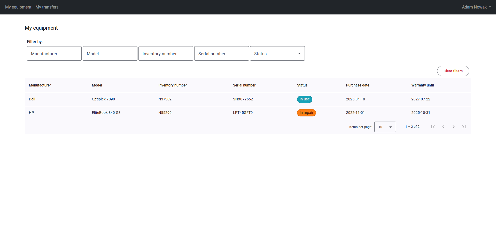
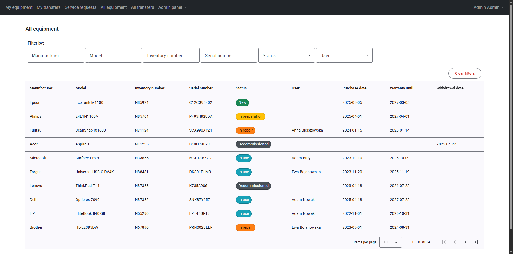
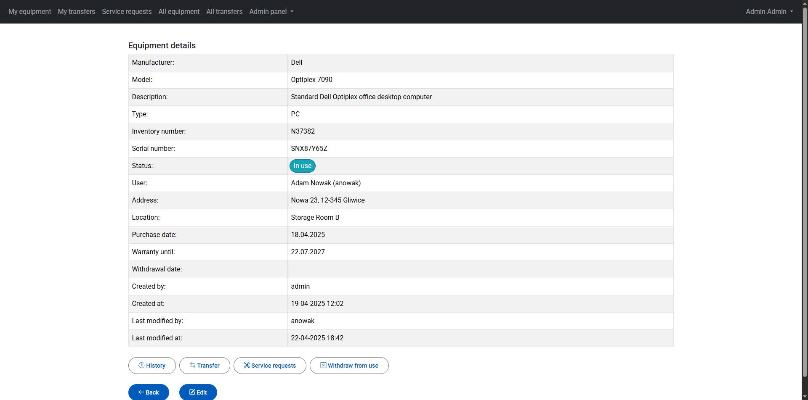
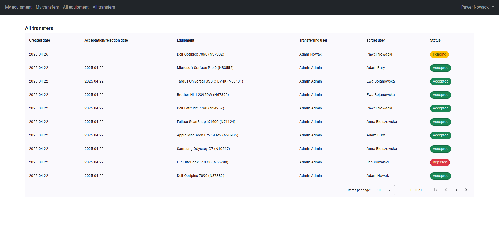
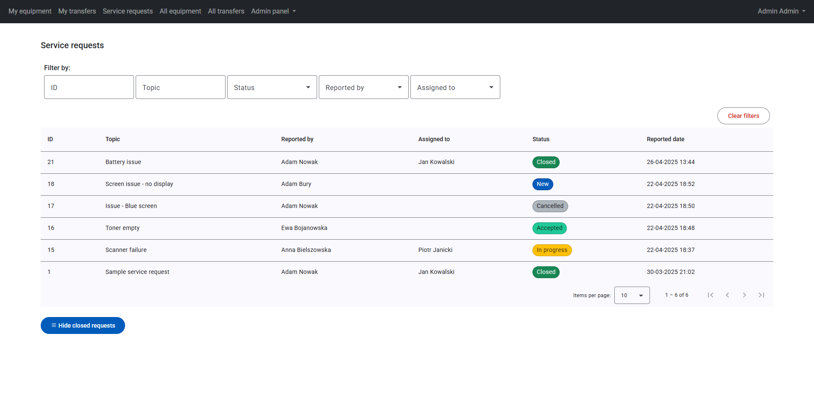
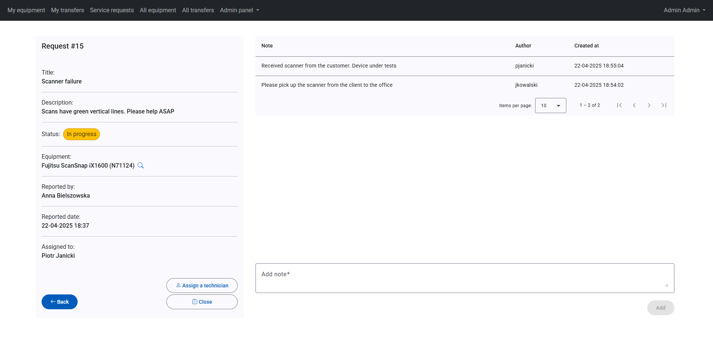
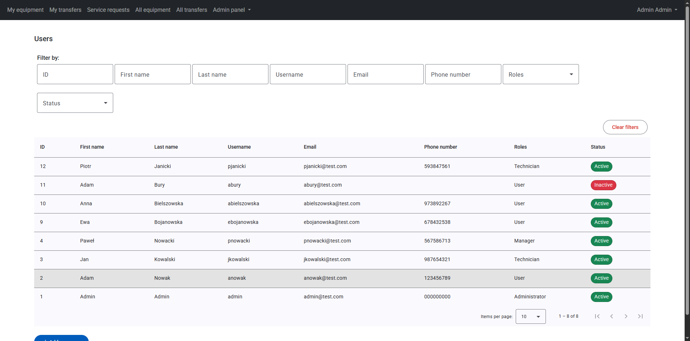
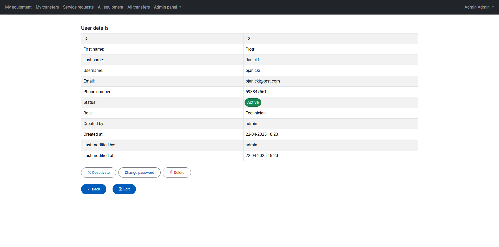
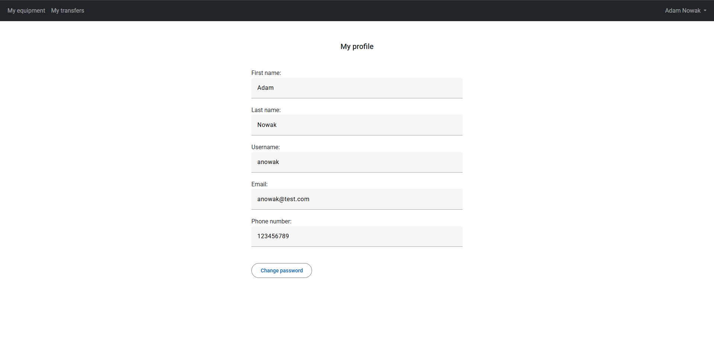

# Equipment Management System

Fullstack application for managing equipment, service requests and user assignments within an organization.

## Technologies used

- **Backend:** Java 21, Spring Boot 3, Spring Data JPA, Hibernate, MapStruct, Lombok
- **Frontend:** Angular 19, RxJS, Signals, Angular Material, Bootstrap
- **Database:** PostgreSQL
- **Security:** Spring Security, JWT
- **Testing:** JUnit 5, Mockito
- **API Documentation:** Springdoc OpenAPI (Swagger UI)

## Main features

- Equipment management
- Service request management
- User management
- Transferring equipment between users
- Role-based access control
- Secure JWT-based authentication with token refreshing

## Requirements

- Java 21
- Node.js 22+
- PostgreSQL

## Running the application

### 1. Clone the repository
`git clone https://github.com/kamilholeksa/equipment-management.git`

### 2. Database configuration
Create a PostgreSQL database and configure connection settings in application-dev.properties
```aiignore
url: jdbc:postgresql://localhost:5432/<database_name>
username: <postgres_username>
password: <postgres_password>
```

### 3. Start backend
`./mvnw spring-boot:run`

### 4. Start frontend
```aiignore
npm install
ng serve
```
The application can be accessed at http://localhost:4200. You can log in as "admin" using the same password as its username.
There are several test users with different roles in the application. All users have the same passwords as username.

## Screenshots


*User's equipment page*


*All equipment list*


*Equipment details*


*Equipment transfers page*


*Service requests page*


*Service request details*


*User management page*


*User details*


*User's profile page*